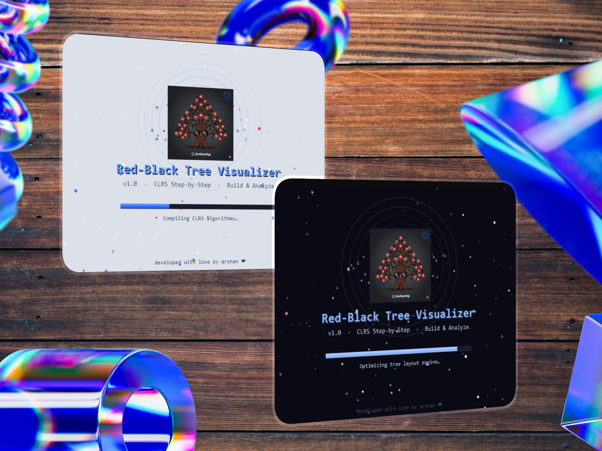
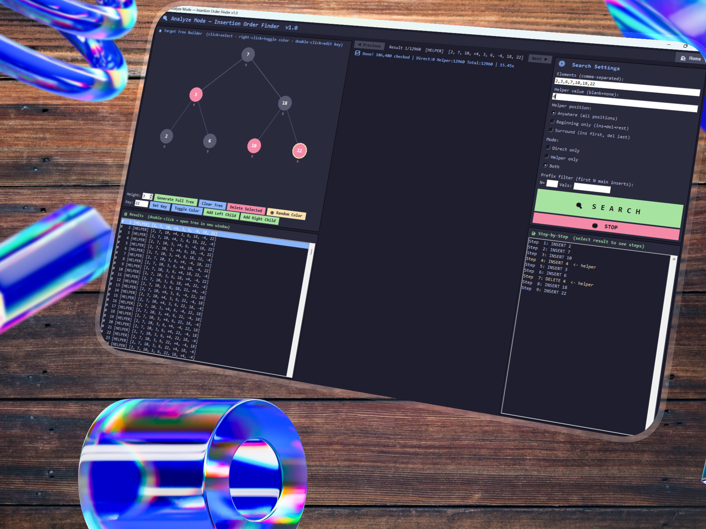
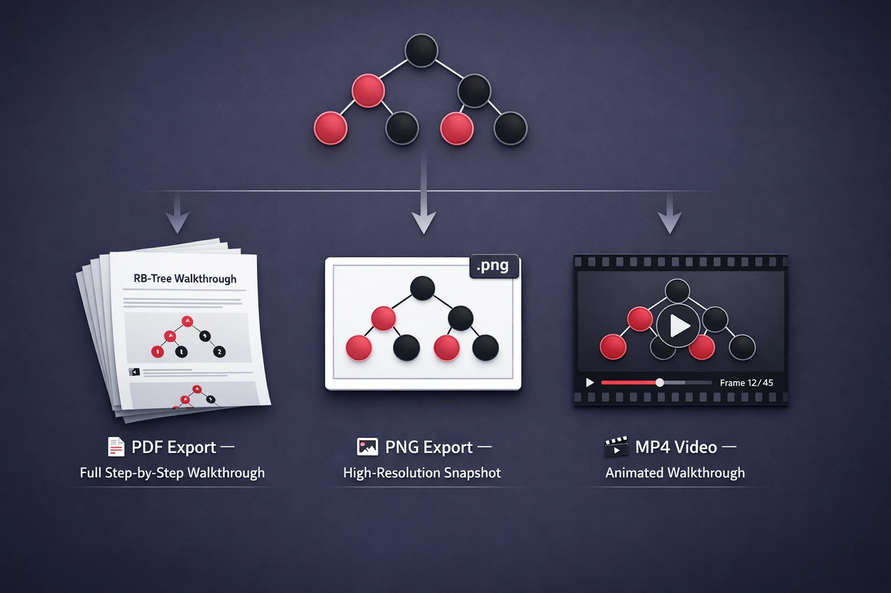
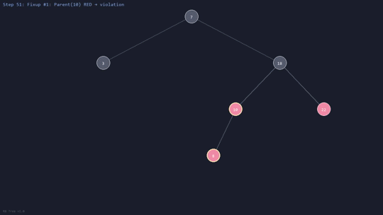

# 🔴⚫ Red-Black Tree Visualizer

### *The Most Complete CLRS Red-Black Tree Educational Tool*

 

> **A fully animated, step-by-step Red-Black Tree visualizer** built for students, educators, and algorithm enthusiasts.
> Implements **exact CLRS pseudocode** with real-time animation, case explanations, and multi-format export.

 

---

## 📸 Screenshots

### 🏗️ Build Mode — Dark & Light Theme

  

### 📖 CLRS Pseudocode Panel

  

### 📊 Analyze Mode

  

### 📦 Export Options — PDF · PNG · MP4

  

### 🎬 Animation Demo

---

## ✨ Features

### 🏗️ Build Mode — Interactive Tree Construction

| Feature | Description |
|:--------|:------------|
| 🎬 **Step-by-Step Animation** | Watch every insert / delete operation unfold one step at a time |
| 📖 **CLRS Pseudocode** | Exact pseudocode from *Introduction to Algorithms* (4th ed.), synced line-by-line |
| 📋 **Case Explanations** | Detailed breakdown of Insert Cases (0–3) and Delete Cases (0–4) |
| 🔄 **Rotations Visualized** | See LEFT-ROTATE and RIGHT-ROTATE happen in real time |
| ⏱️ **Timeline Scrubber** | Jump to any step · rewind · fast-forward — full VCR control |
| 🔍 **Zoom & Pan** | Scroll to zoom, drag to pan — explore large trees easily |
| 📊 **Live Stats** | Node count · black-height · tree height — updated in real time |
| 📝 **Operation Log** | Full history of every operation with clickable replay |

### 📊 Analyze Mode — Comparison & Validation

| Feature | Description |
|:--------|:------------|
| 📈 **BST vs RB-Tree** | Side-by-side height and structure comparison |
| 🎲 **Random Generation** | Generate trees with N random keys instantly |
| ✅ **Property Validation** | Verify all 5 Red-Black Tree properties |
| 🔬 **Performance** | Visualize how RB-Trees maintain $O(\log n)$ height |

### 📦 Export Options

| Format | What You Get |
|:-------|:------------|
| 📄 **PDF** | Full step-by-step walkthrough with pseudocode & case explanations |
| 🖼️ **PNG** | High-resolution snapshot of current tree state |
| 🎥 **MP4** | Animated video of the entire operation sequence |

### 🎨 Themes

| | |
|:--|:--|
| 🌙 **Dark** | Catppuccin Mocha — easy on the eyes |
| ☀️ **Light** | Catppuccin Latte — clean and bright |
| ⚙️ **Settings** | Customize animation speed, node colors, and theme |

---

## 🏗️ Architecture
